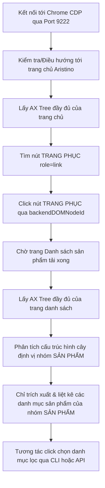

# Hướng Dẫn & Phân Tích Recipe Tự Động Hóa Aristino qua AX Tree

Bản phân tích này dựa trên hai cụm dữ liệu AX Tree thu thập từ Aristino:
1. **Trang chủ (Main)**: `ax_compact_main.txt` / `ax_full_raw_main.json`
2. **Trang danh sách sản phẩm (List)**: `ax_compact_list.txt` / `ax_full_raw_list.json`

---

## 1. Phân Tích Cụm File Trang Chủ (Main)

Mục tiêu trên trang chủ là tìm và click vào danh mục **"TRANG PHỤC"** để chuyển hướng sang trang danh sách sản phẩm. 

Từ file `ax_compact_main.txt`, cấu trúc node được trích xuất như sau:
```text
29:   link | "TRANG PHỤC" | id=536 | url=https://aristino.com/collections/trang-phuc
30:     StaticText | "TRANG PHỤC" | id=178
```

### Phân tích Node:
- **Nút tương tác chính (Link Node)**: Có `role="link"`, `name="TRANG PHỤC"`, và quan trọng nhất là `backendDOMNodeId = 536`.
- **Nút text con (StaticText Node)**: Có `role="StaticText"`, `name="TRANG PHỤC"`, và `backendDOMNodeId = 178`.
- **Hành động (Action)**: Thực hiện click vào link node (`id=536`) để trình duyệt chuyển hướng an toàn tới `https://aristino.com/collections/trang-phuc`.

---

## 2. Phân Tích Cụm File Trang Danh Sách Sản Phẩm (List)

Sau khi chuyển hướng, mục tiêu là tìm khu vực **"BỘ LỌC"** để lựa chọn các danh mục sản phẩm (nằm trong phần **"SẢN PHẨM"**).

Từ file `ax_compact_list.txt`, ta xác định được khu vực bộ lọc nằm ở khoảng dòng **893 đến 1083** với cấu trúc cây như sau:

```text
893:   heading | "BỘ LỌC" | id=1046 | level=3
894:     StaticText | "BỘ LỌC" | id=120
...
897:   button | "NHÃN HÀNG" | id=1058 | expanded
...
906:   button | "MÀU SẮC" | id=1074 | expanded
...
925:   button | "SẢN PHẨM" | id=1105 | expanded
926:     StaticText | "SẢN PHẨM" | id=125
927:   list | id=1109
928:     listitem | id=1110 | | level=1
929:       checkbox | "Áo Blazer" | id=1111
930:     listitem | id=1113 | | level=1
931:       checkbox | "Áo Dài" | id=1114
...
955:       checkbox | "Áo Polo ngắn tay" | id=1150
958:       checkbox | "Áo sơ mi dài tay" | id=1153
961:       checkbox | "Áo sơ mi ngắn tay" | id=1159
971:       checkbox | "Áo thun ngắn tay" | id=1174
977:       checkbox | "Bộ đồ" | id=1183
983:       checkbox | "Quần Âu" | id=1192
1003:       checkbox | "Quần Short" | id=1222
...
1006:   button | "KÍCH CỠ" | id=1236 | expanded
```

### Phân Tích Cấu Trúc Bộ Lọc:
- **Tiêu đề vùng lọc**: `heading | "BỘ LỌC" | id=1046` xác nhận sự hiện diện của thanh bộ lọc bên trái (Sidebar).
- **Bộ lọc Nhóm Sản Phẩm**: Nút mở rộng/thu gọn tên `"SẢN PHẨM"` có `id=1105` ở trạng thái `expanded` (đã mở).
- **Các Checkbox danh mục con (ở ngay dưới nút SẢN PHẨM)**:
  - `"Áo Blazer"`: `id=1111`
  - `"Áo Polo ngắn tay"`: `id=1150`
  - `"Áo sơ mi ngắn tay"`: `id=1159`
  - `"Áo thun ngắn tay"`: `id=1174`
  - `"Bộ đồ"`: `id=1183`
  - `"Quần Âu"`: `id=1192`
  - `"Quần Short"`: `id=1222`

---

## 3. Quy Trình Recipe Tự Động Hóa (Automation Recipe)

Kịch bản tự động hóa trong file [aristino_recipe.py](file:///d:/FPT/Ki_V/DPL302m/group_project/codebase/scraper_v3/sandbox/aristino_recipe.py) được thiết kế theo các bước động để tránh lỗi khi ID thay đổi giữa các phiên tải trang:



---

## 4. Hướng Dẫn Chạy Thử Nghiệm

### Bước 1: Khởi động Chrome với CDP
Hãy chắc chắn trình duyệt Chrome đã được mở bằng cấu hình CDP riêng:
```powershell
# Chạy file batch khởi động Chrome từ thư mục gốc của dự án
.\chrome.bat
```

### Bước 2: Chạy Recipe Automation
Chạy script recipe để xem quá trình điều hướng tự động và tương tác bộ lọc:
```powershell
python sandbox/aristino_recipe.py
```

### Kết quả mong đợi trong Console:
1. Script thông báo kết nối CDP thành công.
2. Trình duyệt tự động mở/chuyển sang `https://aristino.com`.
3. Script tìm thấy nút `"TRANG PHỤC"` (ví dụ: `id=536`), tự động cuộn tới và click.
4. Trình duyệt chuyển sang trang danh sách sản phẩm.
5. Script quét AX Tree mới, định vị khu vực `"BỘ LỌC"` -> `"SẢN PHẨM"`, và in ra danh sách danh mục sản phẩm duy nhất:
   ```text
   DANH MỤC LỌC SẢN PHẨM (SẢN PHẨM):
   ------------------------------
     1. [ ] Áo Blazer (id=59259)
     2. [ ] Áo Dài (id=59262)
     ...
     17. [ ] Áo Polo ngắn tay (id=75909)
     20. [ ] Áo sơ mi ngắn tay (id=75918)
     31. [ ] Quần Âu (id=75951)
   ```
6. Bạn có thể nhập số thứ tự trong terminal (ví dụ: `17` hoặc `20`) để kích hoạt click chọn bộ lọc trực tiếp trên trình duyệt đang mở.
