# OutfitMatch — Bộ Sơ đồ Mermaid cho Thuyết trình

> Tài liệu đi kèm `PHAN_TICH_KIEN_TRUC_MODEL.md`. Mỗi sơ đồ render được trực tiếp trên GitHub, VS Code (Markdown Preview Mermaid), hoặc dán vào <https://mermaid.live> để xuất PNG/SVG đưa vào slide.
>
> **Mục lục sơ đồ:**
> 1. Kiến trúc hệ thống 6 tầng (System Overview)
> 2. Data Pipeline — 7 stage (DAG thu thập & tiền xử lý)
> 3. Training Pipeline — 5 component (đồ thị phụ thuộc)
> 4. SigLIP Contrastive Loss — luồng huấn luyện encoder
> 5a. OutfitTransformer — lắp ráp chuỗi token
> 5b. OutfitTransformer — bên trong một TransformerEncoderLayer
> 6. Inference Pipeline — sequence diagram 6 bước
> 7. Body Shape Classifier — cây quyết định 5 lớp
> 8. Preference Structuring — định tuyến hard/soft
> 9. Conditional Bradley-Terry — luồng preference post-training
> 10. Sprint Map — Gantt 10 tuần ↔ tầng kiến trúc
> 11. Experiment Cycle — lưới ablation một trục

---

## 1. Kiến trúc hệ thống 6 tầng (System Overview)


---

## 2. Data Pipeline — 7 Stage (Thu thập & Tiền xử lý)

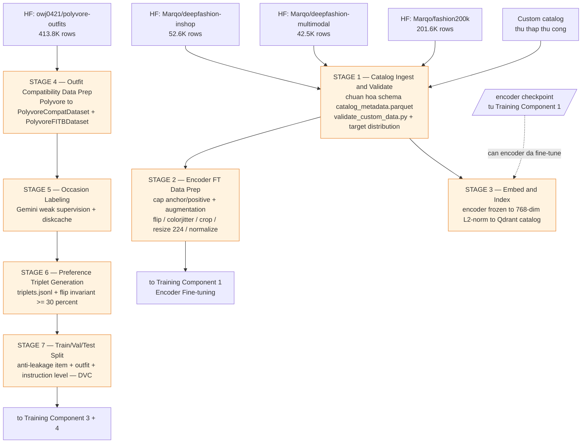

---

## 3. Training Pipeline — 5 Component (Đồ thị phụ thuộc)

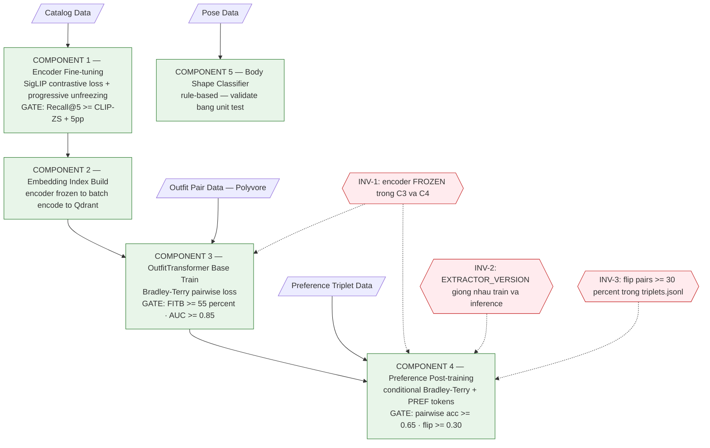

---

## 4. SigLIP Contrastive Loss — Luồng huấn luyện Encoder (Component 1)

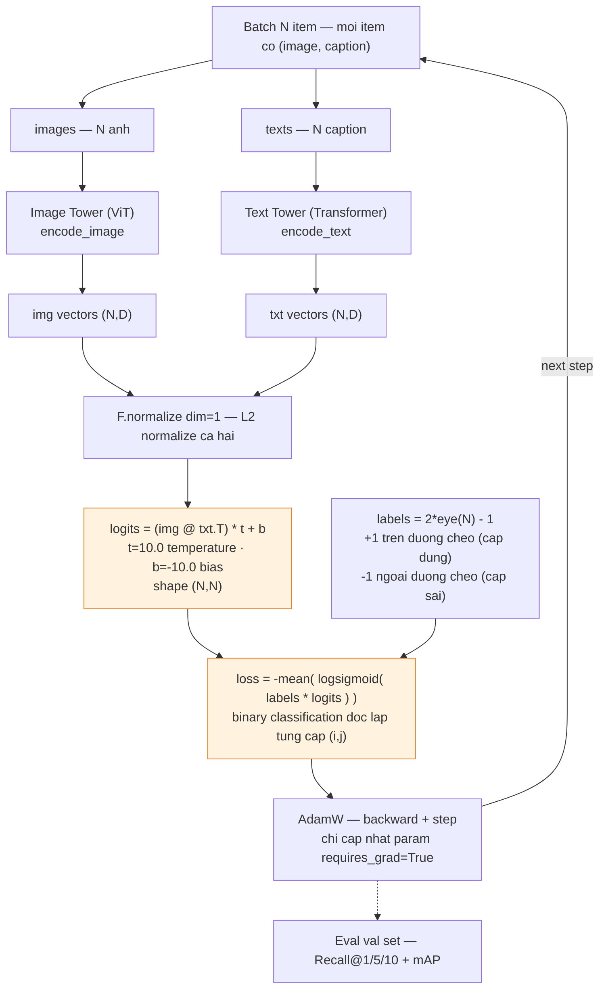

---

## 5a. OutfitTransformer — Lắp ráp chuỗi token (forward)

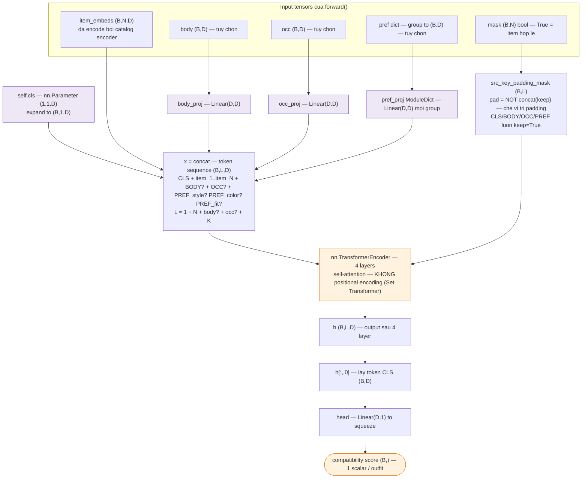

---

## 5b. OutfitTransformer — Bên trong một TransformerEncoderLayer

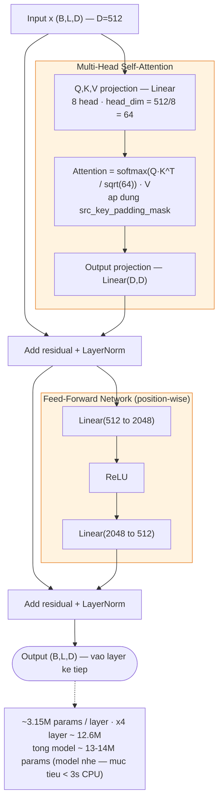

---

## 6. Inference Pipeline — Sequence Diagram 6 bước

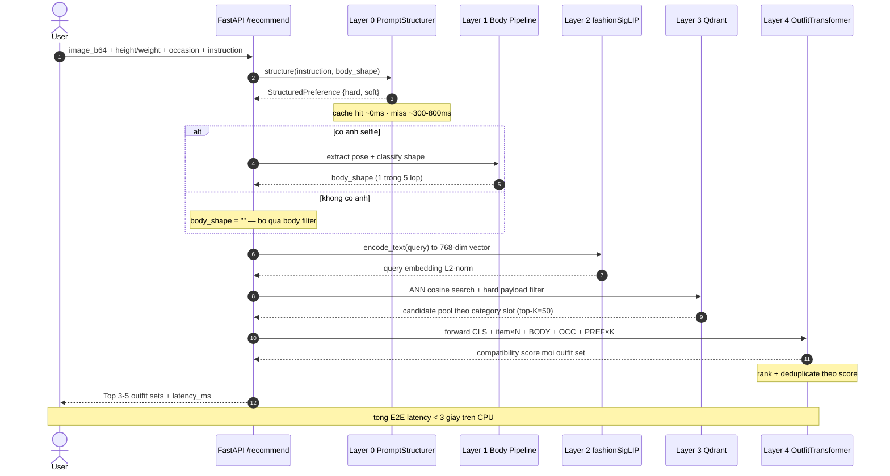

---

## 7. Body Shape Classifier — Cây quyết định 5 lớp

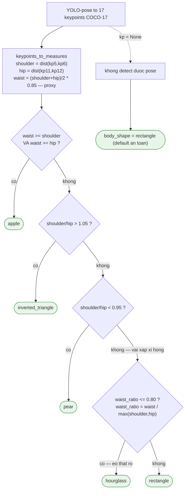

---

## 8. Preference Structuring — Định tuyến hard / soft (Layer 0)

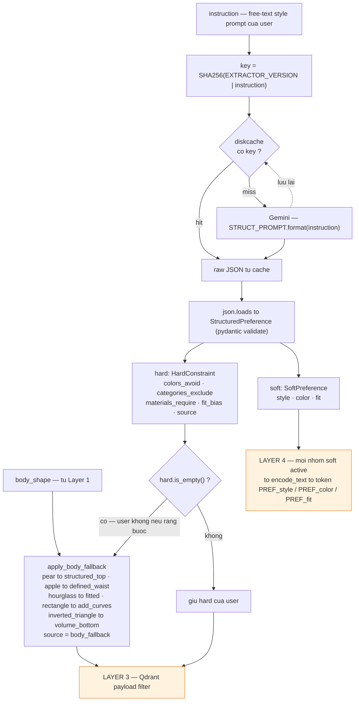

---

## 9. Conditional Bradley-Terry — Luồng Preference Post-training (Component 4)

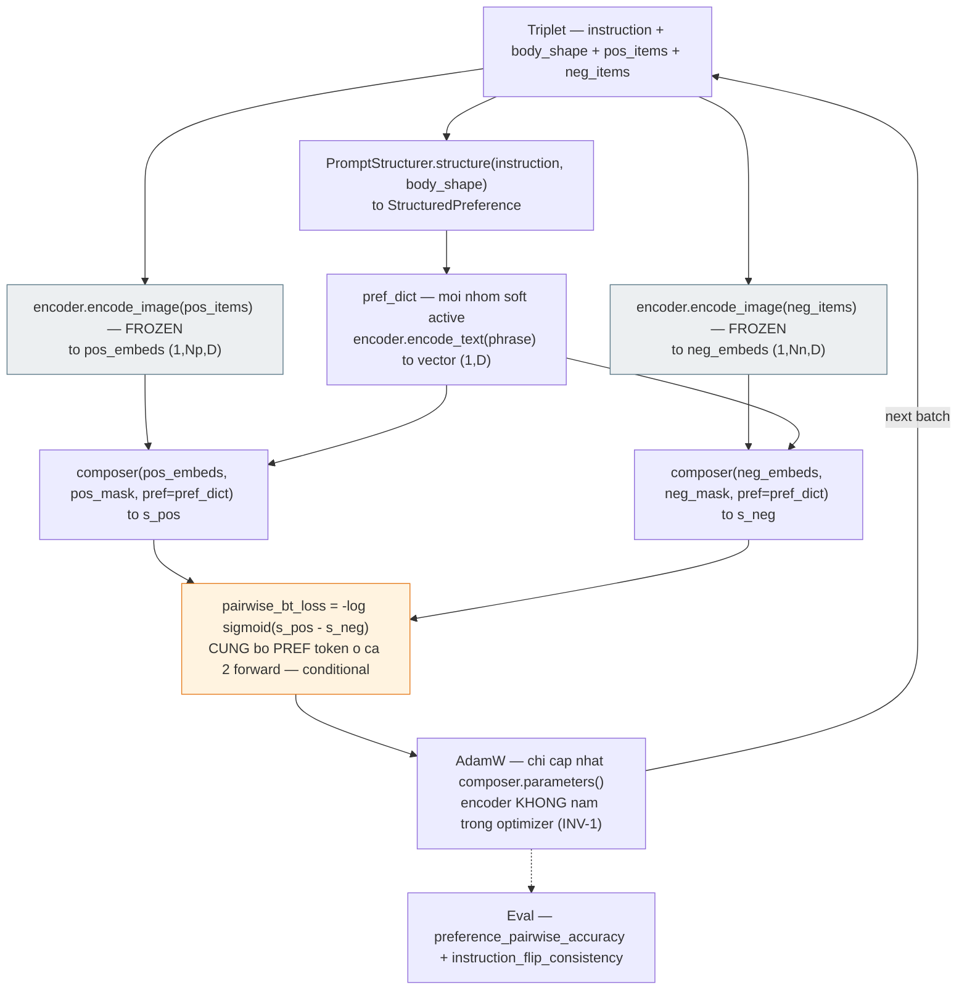

---

## 10. Sprint Map — Gantt 10 tuần ↔ Tầng kiến trúc

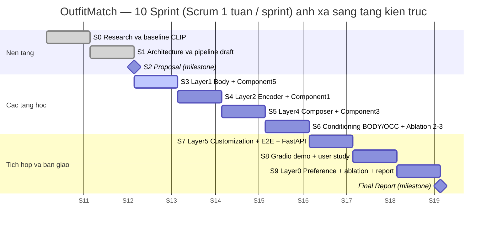

---

## 11. Experiment Cycle — Lưới Ablation một trục (Sprint = Experiment Cycle)

```mermaid
flowchart LR
    CFG["configs/&lt;axis&gt;/*.yaml<br/>moi file = 1 thi nghiem"]

    CLI["om-exp sweep configs/&lt;axis&gt;/<br/>--out-csv docs/experiments/ablation_&lt;axis&gt;.csv"]
    CFG --> CLI

    subgraph RUNNER["runner.execute(cfg) — voi moi config"]
        direction TB
        SEED["set_seed(cfg.seed)"]
        WB["start W&B run — group=sprint · job_type=axis"]
        LOAD["load dataset (max_rows cap) + build_encoder"]
        TRAIN["train (contrastive / composer / preference)"]
        EVALR["evaluate to metrics dict"]
        SEED --> WB --> LOAD --> TRAIN --> EVALR
    end
    CLI --> SEED

    CSV[/"ablation_&lt;axis&gt;.csv — name la row key"/]
    WBCHART["W&B charts — tu dong so sanh cac run"]
    EVALR --> CSV
    EVALR --> WBCHART

    subgraph AXES["4 truc thi nghiem — moi sprint quet DUNG 1 truc"]
        direction TB
        AX1["Model — encoder kind/checkpoint"]
        AX2["Dataset type — hf_id + config"]
        AX3["Rows scaling — max_rows 5K/25K/100K/all"]
        AX4["Conditioning — use_body / use_occ"]
    end
    AXES -.->|"chon 1 truc, co dinh phan con lai"| CFG

    classDef hot fill:#fff3e0,stroke:#e67e22
    class CLI,WBCHART hot
```

---

## Ghi chú render

- **GitHub / VS Code:** hiển thị trực tiếp khi mở file `.md` này.
- **Xuất ảnh cho slide:** dán từng khối ` ```mermaid ` vào <https://mermaid.live> → Export PNG/SVG.
- Sơ đồ **1, 5a, 5b, 6** là "đinh" cho phần deep-dive model — nên phóng to full slide.
- Sơ đồ **2, 3** cho phần data & training pipeline.
- Sơ đồ **10** mở đầu phần Scrum/XP để hội đồng thấy quy trình sinh ra kiến trúc.
