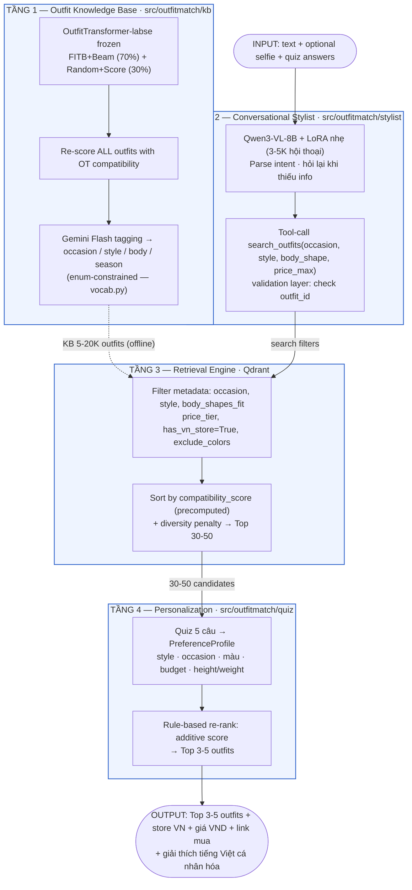
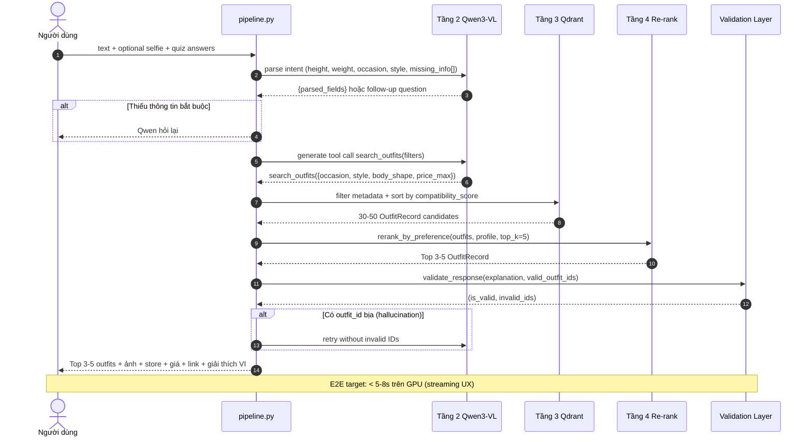
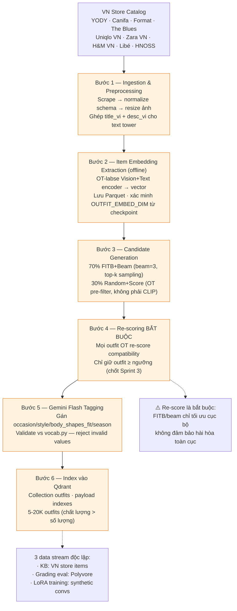
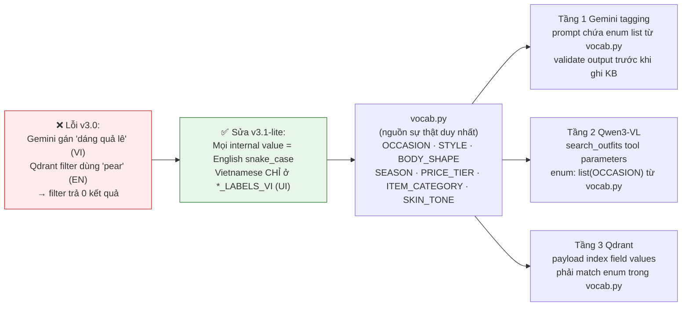

# OutfitMatch — Sơ đồ Mermaid v3.1-lite (Thuyết trình)

> Mỗi sơ đồ render được trực tiếp trên GitHub, VS Code (Markdown Preview Mermaid),
> hoặc dán vào <https://mermaid.live> để xuất PNG/SVG đưa vào slide.
>
> **Mục lục:**
> - V1. Kiến trúc 4 tầng v3.1-lite (System Overview)
> - V2. Inference Pipeline v3.1-lite — sequence diagram 7 bước
> - V3. KB Build Pipeline (Tầng 1) — 6 bước offline
> - V4. Controlled Vocabulary — chống lỗi enum mismatch

---

## V1. Kiến trúc 4 tầng v3.1-lite (System Overview)



---

## V2. Inference Pipeline v3.1-lite — Sequence Diagram 7 bước



---

## V3. KB Build Pipeline (Tầng 1) — 6 bước Offline



---

## V4. Controlled Vocabulary — Chống lỗi Enum Mismatch



---

## Ghi chú render

- **GitHub / VS Code:** hiển thị trực tiếp khi mở file `.md` này.
- **Xuất ảnh cho slide:** dán từng khối ` ```mermaid ` vào <https://mermaid.live>
  → Export PNG/SVG.
- Sơ đồ **V1** mở đầu phần System Overview; **V2** cho deep-dive inference pipeline.
- Sơ đồ **V3** dành cho phần thuyết minh Tầng 1 (offline KB build).
- Sơ đồ **V4** chốt nguyên tắc "controlled vocabulary chống lỗi enum mismatch" — giải thích
  vì sao chia tách `*_LABELS_VI` và internal English enum.
