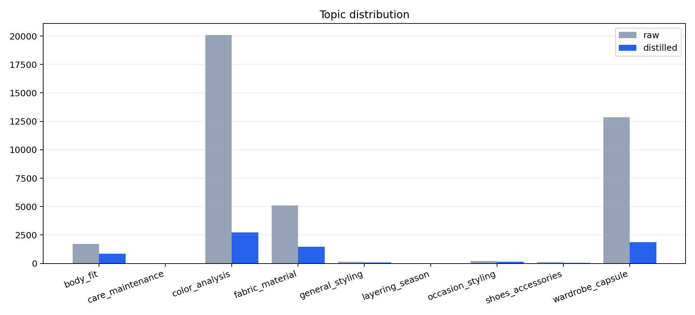
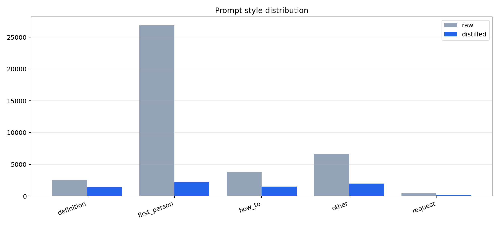
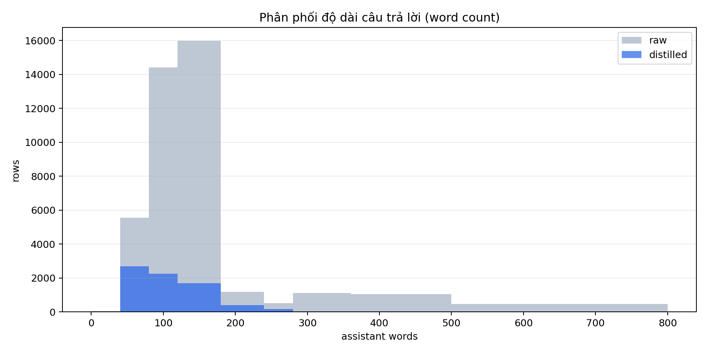
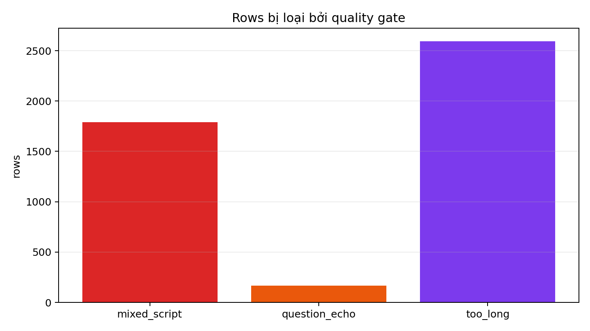
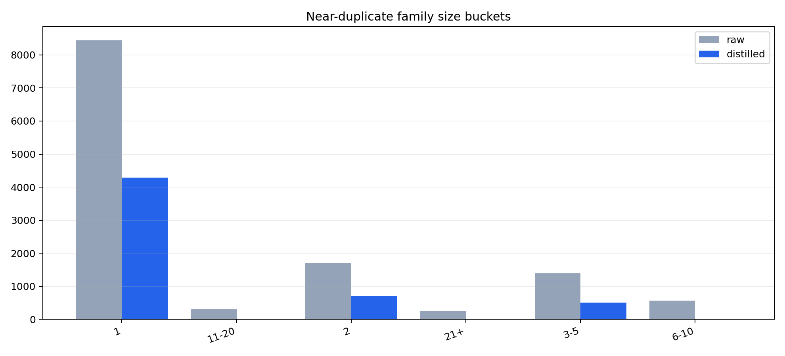

# Stylist knowledge distillation report
**Date:** 2026-06-23  
**Branch:** feature/stylist-knowledge-distill-report
## 1. Executive summary
- Raw `stylist_knowledge`: **40,302** rows.
- Quality gate removed **4,308** rows, giữ lại **35,994** clean rows.
- Final Qwen3.5-9B bundle: **8,800** rows (**7,200 knowledge + 1,600 behavioral**).
- Approx training budget: **1,037,987 words** ≈ **1,297,484 Qwen tokens**.
- Bundle cũ: 5700 rows (5000 knowledge + 700 behavioral).
- Bundle mới: 8800 rows (7200 knowledge + 1600 behavioral).
## 2. Findings
1. **Topic skew rất mạnh**: raw data dồn vào `color_analysis` và `wardrobe_capsule`, nên body/occasion/season bị chìm nếu chỉ sample ngẫu nhiên.
2. **Nhiễu dịch máy có thật**: quality gate phát hiện mixed-script / prompt-echo / overlong essay. Các lỗi này làm model học văn phong lệch, verbose và kém tự nhiên.
3. **Near-duplicate density cao**: nhiều prompt chỉ thay 1 vài cụm nhỏ. Cap `max_per_family=3` giúp giữ coverage mà không nhồi lặp template.
4. **Qwen3.5-9B cần behavioral rows nhiều hơn bundle cũ**: tăng tool-calling, ask-missing-info, recommend-explain để cân bằng giữa knowledge và hành vi hội thoại.
## 3. Charts
### Topic distribution

### Prompt style distribution

### Answer length histogram

### Quality-gate drops

### Near-duplicate family buckets

## 4. Distillation recipe used
- `knowledge_target=7200`
- `max_per_family=3`
- `max_answer_words=280`
- `echo_threshold=0.65`
- Behavioral task mix: `{"ask_missing_info": 250, "body_analysis": 200, "recommend_explain": 300, "polite_decline": 150, "multi_turn": 200, "edge_case": 150, "tool_calling": 350}`
## 5. Flagged raw examples
- **mixed_script** — Q: Tôi có thể làm gì để thêm điểm nhấn cho một chiếc áo blazer cổ điển không? / A: Hãy chọn các họa tiết nhỏ tinh tế như herringbone hoặc pinstripes trong cùng một tông màu để giữ được vẻ thanh lịch tinh tế. Trang trí bằng một chiếc cúc áo nhỏ, khăn túi hoặc шар…
- **mixed_script** — Q: Bạn chọn những món trang sức cổ điển như thế nào? / A: Vật trang sức cổ điển nhấn mạnh sự thanh lịch tinh tế thông qua thiết kế tối giản và chất liệu cao cấp. Những món đồ cơ bản bao gồm серьги ngọc trai, dây chuyền mảnh mai, và đồng…
- **mixed_script** — Q: Điều gì tạo nên một chiếc váy dạ hội bất hủ? / A: Để có một chiếc váy dạ hội trường tồn lâu, một dáng dài với đường nét thanh lịch trong màu sắc trung tính đơn giản vẫn luôn thanh lịch. Chất liệu cao cấp như lụa hoặc satin đảm bả…
- **mixed_script** — Q: Làm thế nào để phối đồ một chiếc áo cardigan cho môi trường làm việc? / A: Bạn có thể mặc cardigan поверх áo sơ mi hoặc áo blouse có cổ, đảm bảo cardigan vừa vặn ở vai. Màu trung tính với chất liệu len dày sẽ tạo nên ấn tượng chuyên nghiệp và tinh tế.
- **mixed_script** — Q: Làm thế nào để mặc một chiếc váy len ấm áp một cách thời髦? / A: Để mặc một chiếc váy len ấm áp thật thời髦, bạn có thể chọn kiểu dáng từ ống trung đến đầu gối, được làm từ chất liệu mềm mại như len merino hoặc cashmere. Thắt vòng eo để tạo thêm…
## 6. Recommended artifact
- Distilled bundle: `data/stylist/fine_tune/runs/stylist_distilled_qwen35_under10k`
- Manifest: `data/stylist/fine_tune/runs/stylist_distilled_qwen35_under10k/manifest.json`
- Recommended for: **QLoRA SFT on Qwen/Qwen3.5-9B** with packing enabled and 1 epoch baseline.