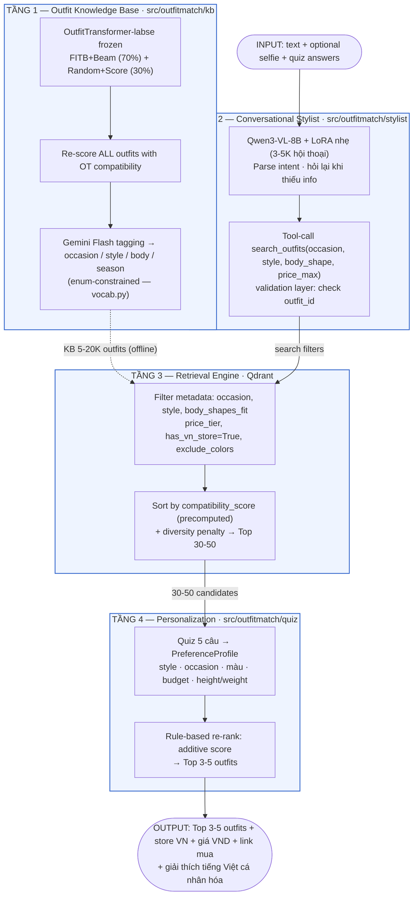
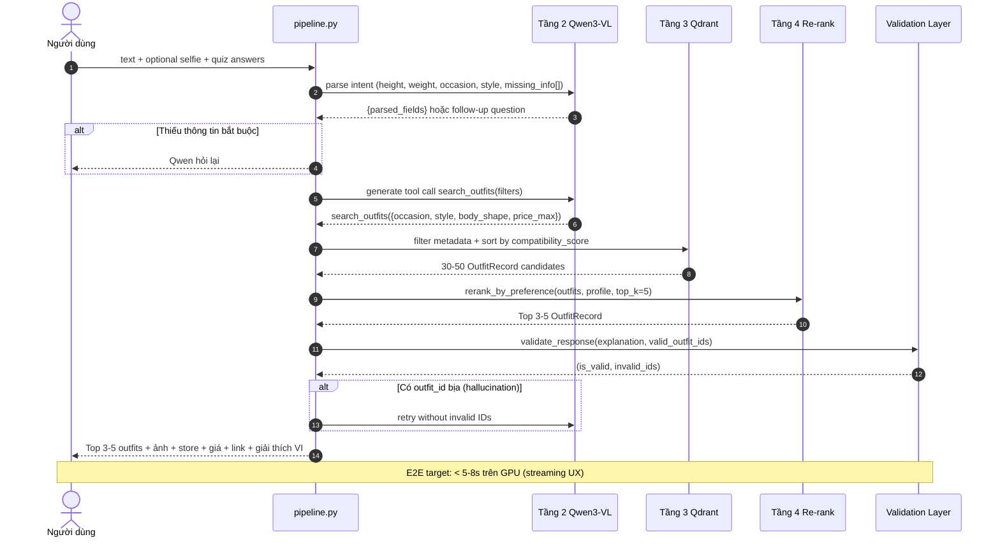
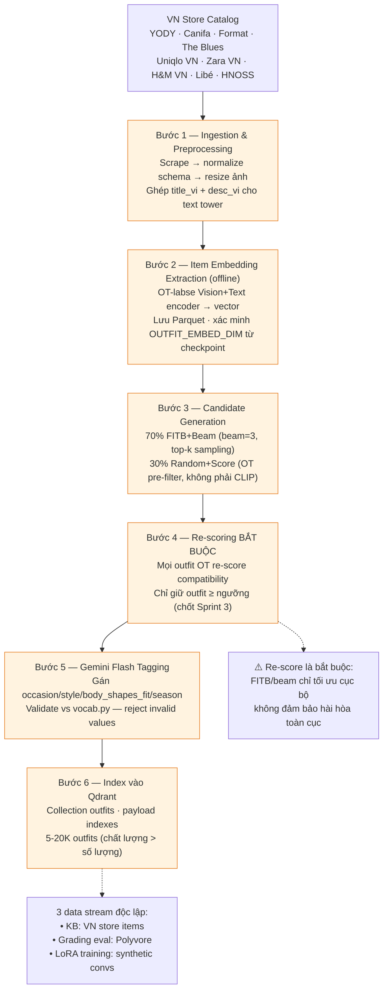
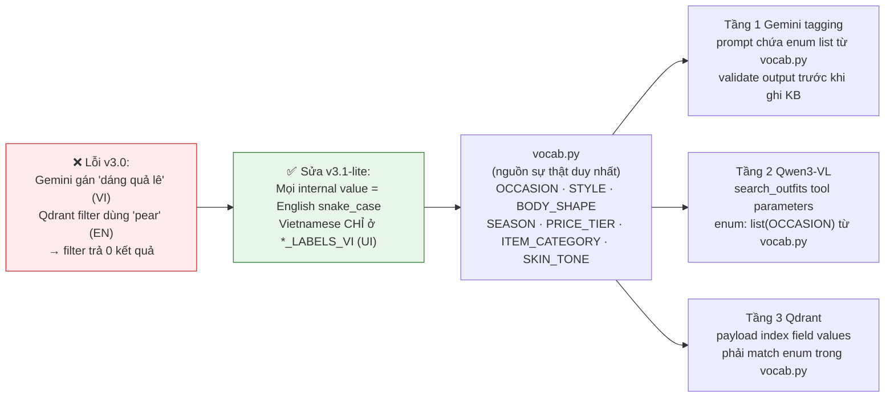

# v3.1-lite Full Project Update — Implementation Plan

> **For agentic workers:** REQUIRED SUB-SKILL: Use superpowers:subagent-driven-development (recommended) or superpowers:executing-plans to implement this plan task-by-task. Steps use checkbox (`- [ ]`) syntax for tracking.

**Goal:** Align all docs and pipeline code with the v3.1-lite 4-tier architecture defined in `Kien_truc_v3.1.md`, replacing outdated 6-layer references.

**Architecture:** v3.1-lite = 4 tiers: (1) KB Builder (OT-labse + FITB) → (2) Conversational Stylist (Qwen3-VL-8B + LoRA) → (3) Retrieval Engine (Qdrant filter-first) → (4) Quiz Re-rank. Grading-experiment infra (encoder ablations, FITB eval, AUC eval) is kept as a parallel sub-system for academic deliverables.

**Tech Stack:** Python 3.13, uv, pytest, pydantic v2, qdrant-client, Qwen3-VL-8B, Mermaid (diagrams).

> **Context (what's already done):**
> - `src/outfitmatch/vocab.py` — complete ✅
> - `src/outfitmatch/kb/` — schema complete, embedding/generation/scoring/tagging as stubs ✅
> - `src/outfitmatch/stylist/` — tools + validation complete, model/data as stubs ✅
> - `src/outfitmatch/quiz/` — schema + rerank fully implemented ✅
> - `CLAUDE.md` — updated for v3.1-lite ✅
>
> **What this plan covers (still outdated):**
> - `docs/ARCHITECTURE.md` — still pure 6-layer ❌
> - `pipeline.py` — still 6-layer flow ❌
> - `docs/datasets/README.md` — phase table misaligned ❌
> - `docs/datasets/STORE_CATALOG_VN.md` — references "Layer 2/3/5" ❌
> - `docs/presentation/SO_DO_MERMAID.md` — all diagrams are 6-layer ❌
> - `docs/EXPERIMENT_GUIDE.md` — no v3.1-lite eval section ❌
> - `docs/feature.md` — empty, no entries ❌

---

## File Structure

**Modify:**
```
docs/ARCHITECTURE.md                    # Full rewrite — v3.1-lite primary + grading sub-system
src/outfitmatch/pipeline.py             # Update to v3.1-lite E2E flow (stub-based)
docs/datasets/README.md                 # Update phase table to v3.1-lite sprint structure
docs/datasets/STORE_CATALOG_VN.md       # Replace "Layer N" with "Tầng N (v3.1-lite)"
docs/presentation/SO_DO_MERMAID.md      # Prepend v3.1-lite diagrams (keep 6-layer diagrams below)
docs/EXPERIMENT_GUIDE.md                # Add v3.1-lite eval section
docs/feature.md                         # Log completed features (vocab, kb, stylist, quiz)
```

**Create:**
```
tests/test_pipeline_v31.py              # Tests for the v3.1-lite pipeline stub
```

---

## Task 1: Rewrite docs/ARCHITECTURE.md for v3.1-lite Primary

**Files:**
- Modify: `docs/ARCHITECTURE.md`

- [ ] **Step 1: Write new ARCHITECTURE.md**

Replace the entire file with the content below. The file is split into two major parts:
- **Part I (§1–§7):** v3.1-lite — the active development target.
- **Part II (§8–§12):** Grading Experiments — the 6-layer sub-system used for encoder ablations and academic deliverables.

```markdown
# OutfitMatch — System Architecture

> **Agents: read this file before writing any code.** It defines module boundaries, data flow, and the invariants every module must respect.

---

## Part I — v3.1-lite: Active Development Target

This is the system described in `Kien_truc_v3.1.md`. All new feature work follows this architecture.

---

## 1. System Overview (v3.1-lite)

```
┌──────────────────────────────────────────────────────────────┐
│  TẦNG 1: OUTFIT KNOWLEDGE BASE (Offline — build once)        │
│  OutfitTransformer-labse (frozen) + FITB/Beam → 5–20K outfit │
│  Gemini Flash metadata tagging → occasion/style/body enums   │
└──────────────────────────────┬───────────────────────────────┘
                               ↓
┌──────────────────────────────────────────────────────────────┐
│  TẦNG 2: CONVERSATIONAL AI STYLIST (Qwen3-VL-8B + LoRA)      │
│  Parse intent · ask follow-up · call search_outfits tool      │
│  Validate outfit_id · generate Vietnamese explanation         │
└──────────────────────────────┬───────────────────────────────┘
                               ↓
┌──────────────────────────────────────────────────────────────┐
│  TẦNG 3: RETRIEVAL ENGINE (Qdrant — filter first)            │
│  Filter by occasion/style/body/price/has_vn_store            │
│  Sort by compatibility_score → Top 30–50 outfits             │
└──────────────────────────────┬───────────────────────────────┘
                               ↓
┌──────────────────────────────────────────────────────────────┐
│  TẦNG 4: PERSONALIZATION (Quiz Re-rank — MVP)                │
│  5-question quiz → PreferenceProfile → additive re-rank      │
│  → Top 3–5 outfits with Vietnamese explanation               │
└──────────────────────────────────────────────────────────────┘
```

---

## 2. Module Responsibilities (v3.1-lite)

| Module | Responsibility | Must NOT do |
|---|---|---|
| `src/outfitmatch/vocab.py` | Single source of truth for all enum values | Define UI labels (use `*_LABELS_VI` for that) |
| `src/outfitmatch/kb/schema.py` | `ItemRecord` + `OutfitRecord` data types | Business logic, I/O |
| `src/outfitmatch/kb/embedding.py` | Extract item embeddings via OT-labse | Filter or tag outfits |
| `src/outfitmatch/kb/generation.py` | FITB+Beam (70%) + random+score (30%) outfit generation | Score or tag outfits |
| `src/outfitmatch/kb/scoring.py` | Re-score all outfits with OT compatibility score | Generate or tag outfits |
| `src/outfitmatch/kb/tagging.py` | Gemini Flash LLM metadata tagging (occasion/style/…) | Score outfits, call encoders |
| `src/outfitmatch/stylist/tools.py` | `search_outfits` tool definition (enum-typed params from vocab) | Model loading, inference |
| `src/outfitmatch/stylist/validation.py` | Extract + validate outfit_id refs in LLM responses | Business logic |
| `src/outfitmatch/stylist/model.py` | Qwen3-VL-8B + LoRA loading + inference | Dataset loading |
| `src/outfitmatch/stylist/data.py` | Conversation dataset for LoRA fine-tuning | Inference |
| `src/outfitmatch/quiz/schema.py` | `QuizAnswers` + `PreferenceProfile` + `quiz_to_profile` | Re-ranking logic |
| `src/outfitmatch/quiz/rerank.py` | Preference-based outfit re-rank | Quiz UI, dataset loading |
| `src/outfitmatch/pipeline.py` | Wire Tầng 2–4 into E2E `recommend_outfit` orchestrator | Training logic |

---

## 3. Controlled Vocabulary Invariant

**File:** `src/outfitmatch/vocab.py` — the single source of truth for all enum values.

All three of these MUST use the same values from `vocab.py`:
1. Gemini Flash LLM-tagging prompt (building the KB)
2. `search_outfits` tool parameters for Qwen3-VL
3. Qdrant payload index field values

**Rule:** Internal values are always English `snake_case`. Vietnamese labels appear ONLY in `*_LABELS_VI` dicts and UI `*_vi` schema fields.

**Never rename** an existing enum value — it would invalidate the entire KB. Add new values; never change old ones.

---

## 4. Knowledge Base Schema

One outfit (`OutfitRecord`) in the KB:

```jsonc
{
  "outfit_id": "OF_00001",
  "schema_version": "3.1",
  "items": [
    {
      "item_id": "item_custom_00001",
      "category": "top",                       // ITEM_CATEGORY enum
      "image_path": "data/custom/catalog/images/item_custom_00001.jpg",
      "item_embedding": [/* OT-labse dim — verify from checkpoint */],
      "store": {
        "store_id": "canifa_vn",
        "store_name": "Canifa",
        "product_url": "https://canifa.com/...",
        "price_vnd": 299000,
        "in_stock": true
      }
    }
  ],
  "outfit_embedding": [/* same dim as item_embedding */],
  "compatibility_score": 0.0,              // ALWAYS re-scored after generation
  "occasion": ["office", "cafe_hangout"],  // OCCASION enum (primary conditioning)
  "style": ["minimalist", "korean"],       // STYLE enum (primary conditioning)
  "body_shapes_fit": ["pear", "hourglass"],
  "season": ["transitional"],
  "color_palette": ["beige", "navy"],
  "price_total_vnd": 850000,
  "price_tier": "mid",
  "has_vn_store": true,
  "stylist_explanation_vi": "...",
  "gen_method": "fitb_beam"
}
```

---

## 5. Retrieval Design (Tầng 3)

v3.1-lite does NOT use a query vector for Qdrant search. Instead:

1. Qwen3-VL calls `search_outfits(occasion, style, body_shape, price_max, exclude_colors)`.
2. Qdrant **filters** by metadata (occasion, style, body_shapes_fit, price_tier, `has_vn_store=True`, exclude_colors).
3. Results are **sorted by `compatibility_score`** (precomputed, descending) + diversity penalty.
4. Top 30–50 are returned to Tầng 4.

This avoids the undefined "user query → outfit embedding space" mapping that was a gap in v3.0.

**Qdrant collection:** `outfits`. Payload indexes on: `occasion`, `style`, `body_shapes_fit`, `price_tier`, `season`, `has_vn_store`.

```python
# Collection config (verify OUTFIT_EMBED_DIM from checkpoint before creating)
qdrant.create_collection(
    collection_name="outfits",
    vectors_config=models.VectorParams(
        size=OUTFIT_EMBED_DIM,  # verify from OT-labse checkpoint — do NOT hardcode
        distance=models.Distance.COSINE,
    ),
)
for field in ["occasion", "style", "body_shapes_fit", "price_tier", "season", "has_vn_store"]:
    qdrant.create_payload_index("outfits", field, models.PayloadSchemaType.KEYWORD)
```

---

## 6. Hallucination Prevention (Tầng 2)

After Qwen3-VL generates a response, extract all `OF_NNNNN` references and verify each exists in the KB:

```python
from outfitmatch.stylist.validation import validate_response

ok, invalid_ids = validate_response(response_text, valid_outfit_id_set)
if not ok:
    # do NOT show response to user — ask Qwen to retry
    pass
```

This is enforced in `pipeline.py`'s E2E flow. Never skip this step.

---

## 7. E2E Inference Pipeline (v3.1-lite)

```
Step 1  User provides text + optional selfie + completed onboarding quiz
Step 2  Qwen3-VL parses → {height, weight, skin_tone, occasion, style, missing_info[]}
Step 3  [Enough info?] ──No──▶ Qwen asks follow-up (loop to Step 1)
         │ Yes
Step 4  Qwen calls search_outfits(filters) → Qdrant filter+sort → 30–50 outfits
Step 5  Tầng 4 re-ranks by PreferenceProfile from quiz → Top 3–5
Step 6  Validation layer verifies all outfit_id refs
Step 7  Qwen generates personalised Vietnamese explanation
Step 8  Display: outfit images + store + price + purchase link; record feedback
```

---

## Part II — Grading Experiments: 6-Layer Sub-system

This sub-system is used **exclusively for academic deliverables**: encoder ablations, FITB accuracy, Compatibility AUC, and body-conditioning experiments. It does NOT replace v3.1-lite as the product architecture.

---

## 8. 6-Layer Grading Architecture (for encoder/composer experiments)

```
Layer 0 — Preference Structuring (src/preference/)
Layer 1 — Body Understanding (src/body/)
Layer 2 — Catalog Encoder (src/encoders/)  ← encoder ablation axis
Layer 3 — Vector Store / Retrieval (Qdrant "catalog" collection)
Layer 4 — Outfit Composer (src/train/composer.py)  ← FITB / AUC axis
Layer 5 — Item Customization (POST /customize-item)
```

Used by: `src/outfitmatch/runner.py`, `om-exp` CLI, `configs/` YAML files, `docs/EXPERIMENT_GUIDE.md`.

---

## 9. Experiment Config Contract (grading experiments)

Every experiment is a YAML file consumed by `ExperimentConfig` (pydantic):

```yaml
name: string
seed: int
task: retrieval|fitb|compatibility|preference
model:
  kind: hf_clip|open_clip
  checkpoint: string
  pretrained: string?
  finetune: bool
dataset:
  hf_id: string
  config: string?
  split: string
  max_rows: int?
train:
  epochs: int
  batch_size: int
  lr: float
  weight_decay: float
  num_workers: int
composer:
  n_heads: int
  n_layers: int
  use_body: bool
  use_occ: bool
  use_pref: bool
  pref_groups: [str]
wandb_project: string
```

**Invariant:** `max_rows` is the ONLY way to vary dataset size. Never hard-code slice logic in model or trainer code.

---

## 10. BaseEncoder Interface (grading experiments)

```python
class BaseEncoder(ABC):
    embed_dim: int
    def encode_image(self, images: list[PIL.Image]) -> torch.Tensor: ...
    def encode_text(self, texts: list[str]) -> torch.Tensor: ...
```

Return shape: `(N, embed_dim)`, L2-normalised. Use `build_encoder(ModelConfig)` from `src/outfitmatch/encoders/factory.py` — never instantiate encoder classes directly outside tests.

---

## 11. Dataset Schema Contracts (grading experiments)

### RetrievalDataset
```python
{"image": PIL.Image, "text": str, "category": str, "item_ID": str}
```

### PolyvoreCompatDataset
```python
{"example_id": str, "items": list[str], "label": int}  # label ∈ {0, 1}
```

### PolyvoreFITBDataset
```python
{"question": list[str], "answers": list[str], "label": int}
```

---

## 12. Grading Targets (DoD for ML results)

| Metric | Target | Measured by |
|---|---|---|
| Recall@5 (retrieval) | CLIP-ZS baseline + 5pp | `evaluate_retrieval()` |
| FITB accuracy | ≥ 55% | `fitb_accuracy()` on Polyvore |
| Compatibility AUC | ≥ 0.85 | `compatibility_auc()` on Polyvore |
| Body-cond. Precision@5 | + 10pp vs non-conditional | composer ablation cycle |
| E2E latency | < 5–8s on GPU / cloud API | timed on GPU (CPU target retired with v3.1-lite) |
| LLM-as-judge (Gemini) | Mean ≥ 3.5 / 5 | Sprint 9 Gemini judge eval |

Required ablations: (1) encoder variants, (2) body conditioning on/off, (3) occasion conditioning on/off, (4) greedy vs beam decoding.

---

## 13. Python 3.13 Constraints (hard rules)

| NEVER use | Use instead |
|---|---|
| `mediapipe` | `ultralytics` (YOLOv8-pose) |
| `faiss-cpu` via pip | `qdrant-client` + Docker |
| `black`, `flake8`, `isort` | `ruff` |
| `flask` | `fastapi` + `uvicorn` |
| `streamlit` | `gradio` |
| `AutoModelForCausalLM` for Qwen3-VL | `Qwen3VLForConditionalGeneration` |
| `evaluation_strategy` in TrainingArguments | `eval_strategy` (new name) |

---

## 14. Definition of Done (XP rule)

A feature is DONE when:
1. PR merged to `dev` with ≥ 1 peer review.
2. `pytest` coverage ≥ 70% for all touched modules, CI green.
3. Docstring present on public functions + entry in `docs/feature.md`.
4. Reproducible: `uv sync && make demo` runs from scratch.
```

- [ ] **Step 2: Run test suite to confirm no breakage**

```
uv run pytest tests/ -v --tb=short -q
```

Expected: same tests pass as before (this is a docs-only change).

- [ ] **Step 3: Commit**

```bash
git add docs/ARCHITECTURE.md
git commit -m "docs: rewrite ARCHITECTURE.md — v3.1-lite primary + grading sub-system"
```

---

## Task 2: Update pipeline.py to v3.1-lite E2E Flow

**Files:**
- Modify: `src/outfitmatch/pipeline.py`
- Create: `tests/test_pipeline_v31.py`

- [ ] **Step 1: Write the failing test**

```python
# tests/test_pipeline_v31.py
from __future__ import annotations

import pytest

from outfitmatch.pipeline import recommend_outfit, RecommendRequest, RecommendResult
from outfitmatch.quiz.schema import QuizAnswers


def test_recommend_outfit_returns_result_type():
    """recommend_outfit returns a RecommendResult, not a raw dict."""
    req = RecommendRequest(
        occasion="office",
        height_cm=160,
        weight_kg=55,
    )
    with pytest.raises(NotImplementedError, match="Sprint"):
        recommend_outfit(req)


def test_recommend_request_requires_occasion():
    """occasion is the only required field per v3.1-lite tool spec."""
    req = RecommendRequest(occasion="date")
    assert req.occasion == "date"
    assert req.height_cm is None
    assert req.weight_kg is None
    assert req.style is None
    assert req.body_shape is None
    assert req.price_max is None
    assert req.exclude_colors == []
    assert req.quiz_answers is None


def test_recommend_result_structure():
    """RecommendResult carries outfits + body_shape + occasion."""
    result = RecommendResult(
        outfits=[],
        body_shape="pear",
        occasion="office",
    )
    assert result.outfits == []
    assert result.body_shape == "pear"
    assert result.occasion == "office"
```

- [ ] **Step 2: Run test to verify it fails**

```
uv run pytest tests/test_pipeline_v31.py -v
```

Expected: `ImportError` — `RecommendRequest` and `RecommendResult` don't exist yet.

- [ ] **Step 3: Rewrite src/outfitmatch/pipeline.py**

```python
# src/outfitmatch/pipeline.py
"""E2E recommendation orchestrator for v3.1-lite.

Pipeline (7 steps from Kien_truc_v3.1.md §7):
  1. Accept RecommendRequest (occasion required; everything else optional)
  2. Qwen3-VL parses intent → structured fields (Sprint 6-7)
  3. If missing required info → ask follow-up (Sprint 6-7)
  4. Call search_outfits → Qdrant filter+sort → 30-50 outfits (Sprint 5)
  5. Re-rank by PreferenceProfile from quiz (Sprint 8)
  6. Validate outfit_id refs (hallucination check)
  7. Qwen generates Vietnamese explanation (Sprint 6-7)

Sprints 5-8 implement the full pipeline. Until then each step raises
NotImplementedError with a clear sprint reference.
"""
from __future__ import annotations

from dataclasses import dataclass, field
from typing import TYPE_CHECKING

if TYPE_CHECKING:
    from outfitmatch.kb.schema import OutfitRecord
    from outfitmatch.quiz.schema import QuizAnswers


@dataclass
class RecommendRequest:
    """Input to the v3.1-lite recommendation pipeline."""

    occasion: str                           # Required — OCCASION enum value
    height_cm: int | None = None
    weight_kg: int | None = None
    style: str | None = None                # STYLE enum value
    body_shape: str | None = None           # BODY_SHAPE enum value
    skin_tone: str | None = None            # SKIN_TONE enum value
    price_max: int | None = None            # Budget cap (VND)
    exclude_colors: list[str] = field(default_factory=list)
    quiz_answers: QuizAnswers | None = None  # From onboarding quiz (Tầng 4)
    image_path: str | None = None           # Optional selfie for body analysis


@dataclass
class RecommendResult:
    """Output from the v3.1-lite recommendation pipeline."""

    outfits: list[OutfitRecord]
    body_shape: str
    occasion: str
    explanation_vi: str = ""
    latency_ms: float = 0.0


def recommend_outfit(request: RecommendRequest) -> RecommendResult:
    """Orchestrate the v3.1-lite 4-tier recommendation pipeline.

    Steps 4-7 are implemented across Sprints 5-8.
    Returns RecommendResult with top 3-5 outfits + Vietnamese explanation.
    """
    raise NotImplementedError(
        "v3.1-lite pipeline: implement Sprint 5 (Qdrant retrieval), "
        "Sprint 6-7 (Qwen3-VL stylist), Sprint 8 (E2E wire-up). "
        "See docs/ARCHITECTURE.md §7 for the full flow."
    )
```

- [ ] **Step 4: Run tests**

```
uv run pytest tests/test_pipeline_v31.py -v
```

Expected: all 3 tests PASS.

- [ ] **Step 5: Run full suite to check no regressions**

```
uv run pytest tests/ -v --tb=short -q
```

Expected: `test_pipeline.py` may now fail (it tests old `recommend_outfit` signature). Check and update `tests/test_pipeline.py` if needed.

- [ ] **Step 6: Update tests/test_pipeline.py if it imports old signature**

Check:
```
uv run pytest tests/test_pipeline.py -v
```

If it fails due to import changes, update the import in `tests/test_pipeline.py`:

Old:
```python
from outfitmatch.pipeline import recommend_outfit
```

The old test likely calls `recommend_outfit(image_path, height, weight, occasion)`.
Since we changed the signature, update the test to use the new `RecommendRequest` dataclass:

```python
# tests/test_pipeline.py
from __future__ import annotations

import pytest

from outfitmatch.pipeline import recommend_outfit, RecommendRequest


def test_recommend_raises_not_implemented():
    req = RecommendRequest(occasion="office", image_path="test.jpg", height_cm=160, weight_kg=55)
    with pytest.raises(NotImplementedError):
        recommend_outfit(req)
```

- [ ] **Step 7: Commit**

```bash
git add src/outfitmatch/pipeline.py tests/test_pipeline_v31.py tests/test_pipeline.py
git commit -m "refactor: update pipeline.py to v3.1-lite RecommendRequest/Result flow"
```

---

## Task 3: Update docs/datasets/README.md

**Files:**
- Modify: `docs/datasets/README.md`

- [ ] **Step 1: Replace the phase table**

Find the "Tổng quan theo Phase" section and replace with v3.1-lite sprint alignment.

Old content (starting at line 6):
```markdown
| Phase | Sprint | Dataset cần | File chi tiết |
|---|---|---|---|
| **1A — Body Pipeline** | S3, S6 | Full-body images + body shape labels | [BODY_PIPELINE.md](BODY_PIPELINE.md) |
| **1B — Catalog Encoder** | S4, S5 | Item images + text descriptions | [CATALOG_ENCODER.md](CATALOG_ENCODER.md) |
| **1C — Outfit Composer** | S5, S6, S7 | Outfit sets + compatibility + occasion labels | [OUTFIT_COMPOSER.md](OUTFIT_COMPOSER.md) |
| **1C+ — Preference** | S9 | Conditional `(instruction, pos, neg)` triplets | [OUTFIT_COMPOSER.md](OUTFIT_COMPOSER.md) §9 |
| **1D — Evaluation** | S8, S9 | User study responses + LLM-as-judge | [USER_STUDY.md](USER_STUDY.md) |
| **Store VN** | manual | Store registry + item-price-store links từ VN stores | [STORE_CATALOG_VN.md](STORE_CATALOG_VN.md) |
```

New content:
```markdown
## Tổng quan theo v3.1-lite Sprint

| Sprint | Tầng | Dataset cần | File chi tiết |
|---|---|---|---|
| **Sprint 0** | Setup | Spike thu thập item VN — chốt quy mô thực tế | — |
| **Sprint 1–2** | Tầng 1 KB | Item images + VN store catalog | [STORE_CATALOG_VN.md](STORE_CATALOG_VN.md) |
| **Sprint 3–4** | Tầng 1 KB | Polyvore (FITB + compat eval); Gemini tagging quota | [OUTFIT_COMPOSER.md](OUTFIT_COMPOSER.md) |
| **Sprint 5** | Tầng 3 Retrieval | KB outfits indexed to Qdrant | — |
| **Sprint 6–7** | Tầng 2 Stylist | 3–5K synthetic conversations (Gemini-generated) | [CATALOG_ENCODER.md](CATALOG_ENCODER.md) |
| **Sprint 8** | E2E | Quiz UI + E2E integration test | [USER_STUDY.md](USER_STUDY.md) |
| **Sprint 9** | Eval | LLM-as-judge (Gemini) + 4 ablations | [USER_STUDY.md](USER_STUDY.md) |

### Grading-experiment datasets (encoder/composer ablations)

| HF Dataset | HF Config | Split | Rows | Phase |
|---|---|---|---:|---|
| `Marqo/deepfashion-inshop` | default | data | 52.6K | Encoder ablation |
| `Marqo/deepfashion-multimodal` | default | data | 42.5K | Encoder ablation |
| `Marqo/fashion200k` | default | data | 201.6K | Encoder ablation |
| `owj0421/polyvore-outfits` | disjoint_fill_in_the_blank | train | 17.0K | FITB / AUC eval |
| `owj0421/polyvore-outfits` | nondisjoint_fill_in_the_blank | train | 53.3K | FITB / AUC eval |
| `owj0421/polyvore-outfits` | disjoint_compatibility | train | 34.0K | AUC eval |
| `owj0421/polyvore-outfits` | nondisjoint_compatibility | train | 106.6K | AUC eval |

Three independent data streams (per Kien_truc_v3.1.md §3.3):
- **KB catalog**: VN store items only (YODY, Canifa, Uniqlo VN, …)
- **OT grading eval**: Polyvore (public benchmark, Western fashion — acceptable for academic grading)
- **Stylist LoRA training**: Synthetic conversations generated by Gemini
```

- [ ] **Step 2: Commit**

```bash
git add docs/datasets/README.md
git commit -m "docs: update datasets/README.md for v3.1-lite sprint structure"
```

---

## Task 4: Update docs/datasets/STORE_CATALOG_VN.md Layer References

**Files:**
- Modify: `docs/datasets/STORE_CATALOG_VN.md`

- [ ] **Step 1: Update the "Vai trò trong kiến trúc" section**

Find the section starting at line 10:
```markdown
## 1. Vai trò trong kiến trúc

Store data ảnh hưởng tới **3 tầng** trong pipeline, mỗi tầng cần schema riêng:

```
Layer 2 (Catalog Encoder)
  catalog_metadata.parquet
  → thêm: store_id, price_vnd, product_url (nullable cho HF-sourced data)

Layer 3 (Vector Store — Qdrant payload)
  → thêm: price_vnd, store_id, store_name, product_url, available_sizes
  → phục vụ: ANN query trả về store info ngay, không cần extra DB lookup

Layer 5 (API Response)
  POST /recommend → outfit suggestion
  → thêm: per-item store_info block trong response JSON
```
```

Replace with:
```markdown
## 1. Vai trò trong kiến trúc (v3.1-lite)

Store data phục vụ **Tầng 1** (KB Builder) và **Tầng 3** (Retrieval) trong pipeline v3.1-lite:

```
Tầng 1 (KB Builder — src/outfitmatch/kb/)
  Item catalog từ VN stores → ItemRecord với store{} block
  → item_embedding, compatibility_score precomputed offline

Tầng 3 (Retrieval — Qdrant collection "outfits")
  Payload: has_vn_store=true, price_tier, store thông tin
  → filter nhanh để chỉ trả kết quả mua được tại VN

API Response (pipeline.py → RecommendResult)
  → mỗi OutfitRecord.items[i].store có đủ link mua + giá VND
```

Store data **KHÔNG** được dùng làm training signal cho OutfitTransformer hoặc Qwen3-VL LoRA.
```

- [ ] **Step 2: Update Qdrant payload section (Section 5)**

Find the old section header:
```markdown
## 5. Schema: Qdrant Payload Extension (Layer 3)

Mỗi point trong collection `catalog` cần thêm các fields sau vào payload:
```

Replace with:
```markdown
## 5. Schema: Qdrant Payload (Tầng 3 — v3.1-lite collection "outfits")

Mỗi point trong collection `outfits` (v3.1-lite) dùng `OutfitRecord.to_qdrant_payload()`:
```

- [ ] **Step 3: Update API response section (Section 6)**

Find:
```markdown
## 6. API Response Extension (Layer 5)

`POST /recommend` response — thêm `store_info` vào mỗi item:
```

Replace with:
```markdown
## 6. API Response (RecommendResult — v3.1-lite)

`recommend_outfit()` → `RecommendResult.outfits` — mỗi `OutfitRecord.items[i].store`:
```

- [ ] **Step 4: Commit**

```bash
git add docs/datasets/STORE_CATALOG_VN.md
git commit -m "docs: update STORE_CATALOG_VN layer references to v3.1-lite tầng terminology"
```

---

## Task 5: Prepend v3.1-lite Mermaid Diagrams to SO_DO_MERMAID.md

**Files:**
- Modify: `docs/presentation/SO_DO_MERMAID.md`

- [ ] **Step 1: Prepend the new section at the top of the file**

Insert the following BEFORE the existing "# OutfitMatch — Bộ Sơ đồ Mermaid cho Thuyết trình" heading:

```markdown
# OutfitMatch — Sơ đồ Mermaid v3.1-lite + 6-layer (Thuyết trình)

> **Mục lục v3.1-lite (các sơ đồ mới — ưu tiên thuyết trình):**
> V1. Kiến trúc 4 tầng v3.1-lite (System Overview)
> V2. Inference Pipeline v3.1-lite — sequence diagram 7 bước
> V3. KB Build Pipeline (Tầng 1) — 6 bước offline
> V4. Controlled Vocabulary — chống lỗi enum mismatch
>
> **Mục lục 6-layer (grading experiments — giữ nguyên phía dưới):**
> 1–15. (như cũ — xem mục lục gốc)

---

## V1. Kiến trúc 4 tầng v3.1-lite (System Overview)



---

## V2. Inference Pipeline v3.1-lite — Sequence Diagram 7 bước



---

## V3. KB Build Pipeline (Tầng 1) — 6 bước Offline



---

## V4. Controlled Vocabulary — Chống lỗi Enum Mismatch



---

```

Then keep the existing content starting from the original `# OutfitMatch — Bộ Sơ đồ Mermaid cho Thuyết trình` heading, renaming it:

```markdown
---

## Sơ đồ 6-layer — Grading Experiments (giữ nguyên cho báo cáo học thuật)

> Các sơ đồ dưới đây mô tả kiến trúc 6-layer dùng cho encoder ablations và academic deliverables.
> Hệ thống sản phẩm (v3.1-lite) được mô tả ở các sơ đồ V1–V4 phía trên.

[... existing content from diagram 1 through 15 unchanged ...]
```

- [ ] **Step 2: Commit**

```bash
git add docs/presentation/SO_DO_MERMAID.md
git commit -m "docs: prepend v3.1-lite Mermaid diagrams (V1-V4) to SO_DO_MERMAID.md"
```

---

## Task 6: Update docs/EXPERIMENT_GUIDE.md for v3.1-lite Eval

**Files:**
- Modify: `docs/EXPERIMENT_GUIDE.md`

- [ ] **Step 1: Add v3.1-lite eval section at the top**

Insert BEFORE the existing "# Experiment Guide" heading:

```markdown
# Experiment Guide — OutfitMatch (v3.1-lite + Grading)

> **Two evaluation tracks:**
> 1. **v3.1-lite product eval** — LLM-as-judge (Gemini), E2E latency, body-conditional precision. Sprint 9.
> 2. **Grading experiment cycles** — encoder ablations, FITB accuracy, Compatibility AUC. Runs continuously via `om-exp sweep`. See §Grading Cycles below.
```

Then insert a new section BEFORE "## Quick Start: Running an Experiment":

```markdown
## v3.1-lite Evaluation (Sprint 9)

### LLM-as-Judge (Gemini)

Rate each RecommendResult on a 1–5 scale using Gemini as the judge:

```python
# scripts/llm_judge.py
# Input: list of RecommendResult (outfit recommendation + explanation_vi)
# Output: docs/experiments/llm_judge_results.csv
# Target: mean score >= 3.5/5
```

Run:
```bash
uv run python scripts/llm_judge.py \
    --results data/eval/recommend_results.jsonl \
    --out docs/experiments/llm_judge_results.csv
```

### Body-Conditional Precision@5 Ablation (v3.1-lite)

Compare Qdrant retrieval with and without `body_shapes_fit` filter:

```bash
# Ablation: body_shape filter ON vs OFF
# Metric: Precision@5 on manually labelled body-shape suitability
# Target: +10pp with filter ON
uv run python scripts/ablation_body_filter.py \
    --out docs/experiments/ablation_body_filter_v31.csv
```

### E2E Latency Measurement

```bash
# Measure end-to-end latency on GPU (target: 5-8s, streaming UX)
uv run python scripts/measure_latency.py \
    --n-requests 50 \
    --out docs/experiments/latency_v31.csv
```

### Ablation 4 — Greedy vs Beam Decoding (KB build)

Already baked into Tầng 1 KB build pipeline (Kien_truc_v3.1.md §3.4 Bước 3).
Measure FITB accuracy of the resulting KB under each method:

```bash
uv run python scripts/ablation_decoding.py \
    --kb-greedy data/kb/kb_greedy.parquet \
    --kb-beam   data/kb/kb_beam.parquet \
    --out docs/experiments/ablation_decoding.csv
```

---

## Grading Experiment Cycles (encoder / composer)
```

- [ ] **Step 2: Keep all existing content below (no other changes)**

- [ ] **Step 3: Commit**

```bash
git add docs/EXPERIMENT_GUIDE.md
git commit -m "docs: add v3.1-lite eval section to EXPERIMENT_GUIDE.md"
```

---

## Task 7: Update docs/feature.md — Log Completed Features

**Files:**
- Modify: `docs/feature.md`

- [ ] **Step 1: Replace the empty feature log with completed entries**

```markdown
# Feature Log

Each merged feature gets one entry here. Format: `## feature-name` → brief description → sprint.

---

## vocab — Controlled Vocabulary

`src/outfitmatch/vocab.py` — single source of truth for all enum values (OCCASION, STYLE, BODY_SHAPE, SEASON, PRICE_TIER, ITEM_CATEGORY, SKIN_TONE). Frozen sets for O(1) membership checks. Vietnamese labels in `*_LABELS_VI` dicts (UI only). `validate_enum_values()` helper for LLM-tagging pipeline.

Sprint 0 — scaffolding. Commit: `feat: add controlled vocabulary module (vocab.py) for v3.1-lite`

---

## kb-schema — Knowledge Base Data Types

`src/outfitmatch/kb/schema.py` — `ItemRecord` (per-item catalog entry with VN store block) and `OutfitRecord` (full KB entry with `to_qdrant_payload()`). `schema_version="3.1"` for traceability. `occasion` + `style` as primary conditioning fields (enum-typed, ready for token conditioning in Phụ lục A).

Sprint 0 — scaffolding. Commit: `feat: add kb/ module scaffold (schema + stubs for Sprint 1-4)`

---

## stylist-tools — Qwen3-VL Tool Definition + Hallucination Check

`src/outfitmatch/stylist/tools.py` — `SEARCH_OUTFITS_TOOL` dict with enum-typed parameters sourced directly from `vocab.py`. `src/outfitmatch/stylist/validation.py` — `extract_outfit_ids()` and `validate_response()` for post-generation hallucination detection.

Sprint 0 — scaffolding. Commit: `feat: add stylist/ module (tools + validation fully implemented, model stub)`

---

## quiz-rerank — Preference-Based Re-rank

`src/outfitmatch/quiz/schema.py` — `QuizAnswers` (5-question onboarding), `PreferenceProfile`, `quiz_to_profile()`. `src/outfitmatch/quiz/rerank.py` — `score_outfit_for_preference()` (additive: style +0.10, occasion +0.10, color +0.05, wrong price tier −0.10) and `rerank_by_preference()`.

Sprint 0 — scaffolding. Commit: `feat: add quiz/ module (QuizAnswers, PreferenceProfile, preference re-rank)`

---

## pipeline-v31 — v3.1-lite E2E Request/Result Types

`src/outfitmatch/pipeline.py` — `RecommendRequest` (occasion required; everything else optional) and `RecommendResult` dataclasses establishing the v3.1-lite pipeline contract. Full implementation in Sprint 5–8.

Sprint 0 — scaffolding. Commit: `refactor: update pipeline.py to v3.1-lite RecommendRequest/Result flow`
```

- [ ] **Step 2: Commit**

```bash
git add docs/feature.md
git commit -m "docs: log completed Sprint 0 features (vocab, kb-schema, stylist, quiz, pipeline)"
```

---

## Task 8: Final — Run Full Suite and Push

- [ ] **Step 1: Run full test suite**

```
uv run pytest tests/ -v --tb=short
```

Expected: all tests pass. Note any failures and fix inline before committing.

- [ ] **Step 2: Run lint**

```
uv run ruff check src/ tests/
uv run ruff format --check src/ tests/
```

Expected: no errors. Fix any ruff issues:
```
uv run ruff format src/ tests/
uv run ruff check --fix src/ tests/
```

- [ ] **Step 3: Commit any lint fixes**

```bash
git add -p
git commit -m "style: apply ruff format fixes"
```

- [ ] **Step 4: Push to remote**

```bash
git push origin Model
```

Expected: branch updated on remote.

---

## Self-Review

### Spec coverage check (vs Kien_truc_v3.1.md)

| Section | Covered |
|---|---|
| Phần 0: Executive Summary — 4-tier architecture | ARCHITECTURE.md Part I §1 ✅ |
| Phần 1: Kiến trúc hệ thống diagram | ARCHITECTURE.md §1 + SO_DO_MERMAID.md V1 ✅ |
| Phần 2: Controlled Vocabulary invariant | ARCHITECTURE.md §3 + SO_DO_MERMAID.md V4 ✅ |
| Phần 3: Tầng 1 schema (OutfitRecord) | ARCHITECTURE.md §4 ✅ |
| Phần 3: KB build pipeline 6 bước | SO_DO_MERMAID.md V3 ✅ |
| Phần 3: Nguồn dữ liệu VN stores | datasets/README.md Sprint 1-2 + STORE_CATALOG_VN.md ✅ |
| Phần 4: Tool-calling, validation layer | ARCHITECTURE.md §6 ✅ |
| Phần 5: Qdrant filter-first retrieval | ARCHITECTURE.md §5 ✅ |
| Phần 6: Quiz re-rank | ARCHITECTURE.md §7 (Step 5) ✅ |
| Phần 7: E2E pipeline flow | ARCHITECTURE.md §7 + SO_DO_MERMAID.md V2 ✅ |
| Phần 8: Grading metrics | ARCHITECTURE.md §12 ✅ |
| Phần 9: Roadmap 10 tuần | datasets/README.md sprint table ✅ |
| Phần 10: Rủi ro — hallucination | ARCHITECTURE.md §6 ✅ |
| Phần 10: Rủi ro — OT domain shift | ARCHITECTURE.md §12 note ✅ |
| pipeline.py E2E contract | Task 2 ✅ |
| feature.md log | Task 7 ✅ |
| EXPERIMENT_GUIDE v3.1 eval | Task 6 ✅ |

### Placeholder scan

- `pipeline.py` raises `NotImplementedError` with explicit Sprint references — intentional stub ✅
- All test files contain actual test code ✅
- All documentation contains actual content (no "TBD" or "fill in later") ✅

### Type consistency check

- `RecommendRequest` uses `QuizAnswers | None` — `QuizAnswers` imported from `quiz.schema` ✅
- `RecommendResult.outfits: list[OutfitRecord]` — `OutfitRecord` imported from `kb.schema` ✅
- Both are `TYPE_CHECKING`-guarded to avoid circular imports at runtime ✅
