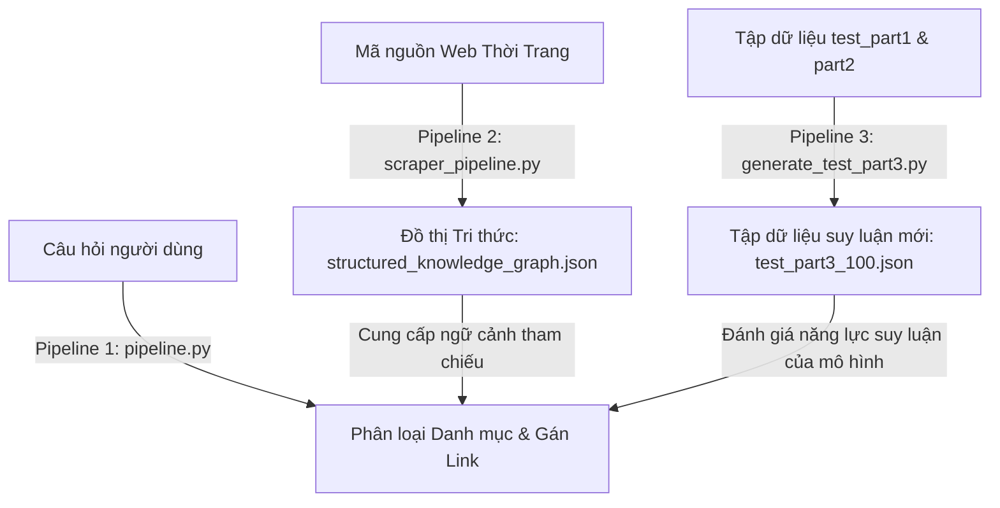
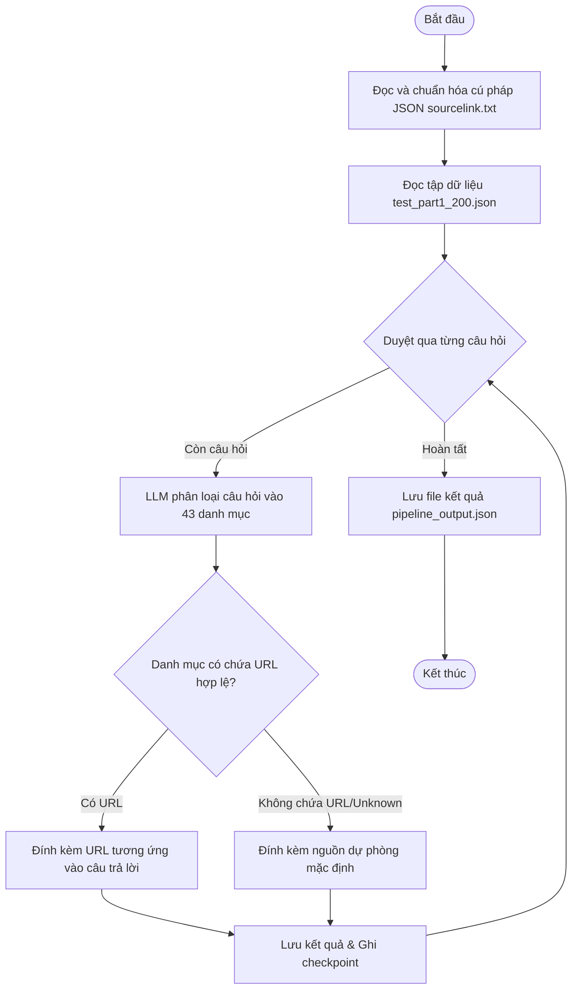
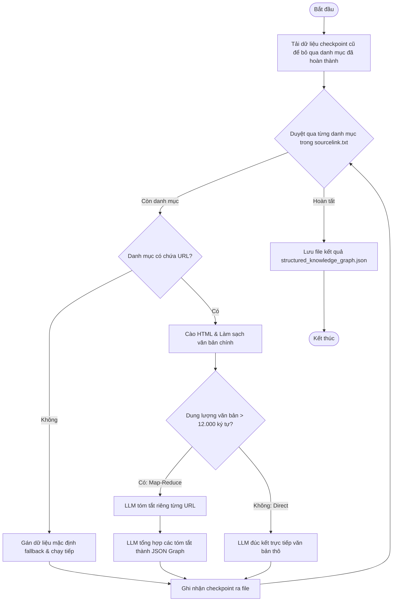
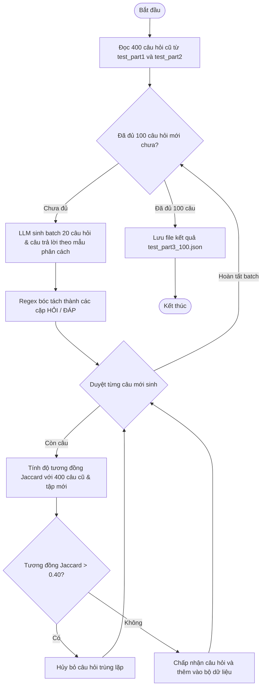

# BÁO CÁO QUY TRÌNH TRIỂN KHAI HỆ THỐNG AGENTIC RAG & KNOWLEDGE GRAPH

Tài liệu này tổng hợp chi tiết toàn bộ quá trình xây dựng, tối ưu hóa và thực thi hệ thống RAG thời trang, bao gồm **3 Pipeline cốt lõi**:
1. **Pipeline Phân Loại Câu Hỏi & Gán Nguồn** (`pipeline.py`).
2. **Pipeline Cào Web & Xây Dựng Đồ Thị Tri Thức** (`scraper_pipeline.py`).
3. **Pipeline Sinh Bộ Dữ Liệu Test Suy Luận** (`generate_test_part3.py` & `clean_dataset.py`).

---

## TỔNG QUAN HỆ THỐNG (SYSTEM OVERVIEW)



---

## CHI TIẾT 3 PIPELINE CỐT LÕI

### 1. Pipeline Phân Loại Câu Hỏi & Gán Nguồn (`pipeline.py`)

* **Mục tiêu**: Tự động phân loại các câu hỏi thời trang của người dùng vào 43 danh mục cụ thể, sau đó trích xuất và đính kèm chính xác URL nguồn từ cấu hình `sourcelink.txt` vào cuối câu trả lời.
* **Cơ chế hoạt động**:
  - Đọc và tự động sửa lỗi cú pháp JSON của file cấu hình `sourcelink.txt`.
  - Khởi tạo chuỗi phân loại LangChain LCEL (gọi local Ollama hoặc API Groq/OpenAI).
  - So khớp danh mục được LLM phân loại với mảng URL trong cấu hình. Nếu danh mục có chứa URL, đính kèm vào trường `"generated_text"`. Nếu danh mục trống hoặc thuộc nhóm `"unknown"`, hệ thống tự động gán nguồn dự phòng mặc định: *"Kiến thức thời trang tổng hợp (Nguồn Internet)"*.

#### Lưu đồ hoạt động (Flowchart 1):


---

### 2. Pipeline Cào Web & Xây Dựng Đồ Thị Tri Thức (`scraper_pipeline.py`)

* **Mục tiêu**: Tự động cào dữ liệu từ các trang web thời trang, làm sạch nội dung thô và tổng hợp thành đồ thị tri thức cấu trúc dạng JSON phục vụ trực tiếp cho RAG tra cứu.
* **Cơ chế hoạt động**:
  - **Làm sạch mã độc HTML**: Dùng BeautifulSoup4 bóc tách và loại bỏ hoàn toàn các thẻ thừa như `<script>`, `<style>`, `<nav>`, `<footer>`, `<header>`, `<aside>`, `<form>`, `<iframe>`.
  - **Cơ chế Map-Reduce**: 
    - Nếu tổng dung lượng bài viết lớn (>12.000 ký tự), hệ thống chạy bước **Map** (gọi LLM tóm tắt ý chính của từng URL riêng biệt).
    - Sau đó chạy bước **Reduce** (gộp các bản tóm tắt để đúc kết ra đồ thị tri thức chung gồm 4 trường: `consensus_rules`, `conflicts_to_note`, `key_items`, `outdated_trends_to_avoid`).
  - **Xoay vòng khóa & Fallback**: Tự động xoay vòng API Key kết hợp chuỗi mô hình dự phòng trên Groq (`llama-3.3-70b-versatile` -> `qwen/qwen3-32b` -> `llama-3.1-8b-instant`), đảm bảo vượt qua Rate Limit (429).
  - **Checkpoint**: Cho phép bỏ qua các danh mục đã đúc kết thành công ở lần chạy trước.

#### Lưu đồ hoạt động (Flowchart 2):


---

### 3. Pipeline Sinh Bộ Dữ Liệu Test Suy Luận (`generate_test_part3.py`)

* **Mục tiêu**: Tạo ra 100 câu hỏi và câu trả lời kiểm thử thời trang hoàn toàn mới, không trùng lặp ngữ nghĩa với 400 câu hỏi có sẵn, nhằm đánh giá khả năng xử lý các câu hỏi mơ hồ, thiếu chi tiết hoặc ràng buộc mâu thuẫn của mô hình.
* **Cơ chế hoạt động**:
  - Nạp 400 câu hỏi cũ từ `test_part1` và `test_part2`.
  - Gọi LLM sinh các câu hỏi thời trang theo các nhóm độ khó:
    1. *Câu hỏi mơ hồ/thiếu thông tin*: Chatbot phải hỏi ngược lại để làm rõ nhu cầu.
    2. *Ràng buộc cực đoan/mâu thuẫn*: Chatbot phải từ chối lịch sự dựa trên thực tế sức khỏe/thời tiết và đề xuất giải pháp thay thế.
    3. *Tấn công prompt (Prompt Injection)*: Chatbot phải từ chối khéo léo để tập trung vai trò tư vấn.
  - **Lọc trùng lặp (Jaccard Filter)**: Mỗi câu hỏi mới sinh được tính toán độ trùng lặp từ vựng với toàn bộ 400 câu cũ. Nếu độ tương đồng Jaccard > 0.40, câu hỏi đó sẽ bị hủy bỏ ngay lập tức và sinh lại.
  - **Parser văn bản thô**: Sử dụng cấu trúc phân cách `=== HỘI THOẠI ===` kết hợp Regex để tách trường HỎI/ĐÁP, loại bỏ hoàn toàn lỗi cú pháp JSON khi mô hình sinh chuỗi tự nhiên có dấu ngoặc kép.

#### Lưu đồ hoạt động (Flowchart 3):


---

## HƯỚNG DẪN VẬN HÀNH HỆ THỐNG

### 1. Phân loại câu hỏi 200 mẫu gốc:
```bash
python -X utf8 pipeline.py --input processed/test_part1_200.json --provider groq
```

### 2. Cào dữ liệu web và tạo đồ thị tri thức:
```bash
python -X utf8 scraper_pipeline.py --provider groq
```

### 3. Sinh bộ dữ liệu test suy luận mới 100 câu:
```bash
python -u -X utf8 generate_test_part3.py
```
*(Nếu muốn dọn dẹp các khối suy nghĩ thừa và sinh bù câu mới)*:
```bash
python -X utf8 C:\Users\hi\.gemini\antigravity-ide\brain\a34a4276-13ca-4c54-83cb-ee3bfd214b06\scratch\clean_dataset.py
```

---

## KẾT QUẢ ĐẠT ĐƯỢC
* **structured_knowledge_graph.json**: Chứa toàn bộ tri thức đúc kết sâu sắc của 18 danh mục thời trang có link thực tế (ví dụ: `office_wear`, `wedding_and_evening`, `layering`...).
* **test_part3_100.json**: 100 mẫu hội thoại chuẩn chỉnh, không trùng lặp và đa dạng hóa kịch bản suy luận.
* **Độ ổn định**: Chịu lỗi 100%, không bị ảnh hưởng bởi giới hạn Rate Limit (429) nhờ tính năng xoay vòng khóa API.
