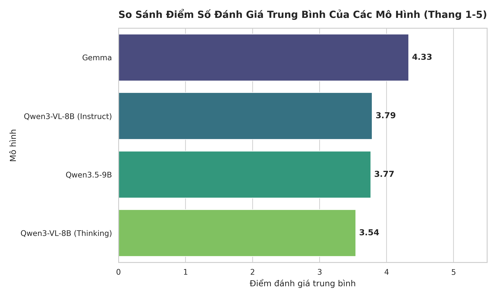
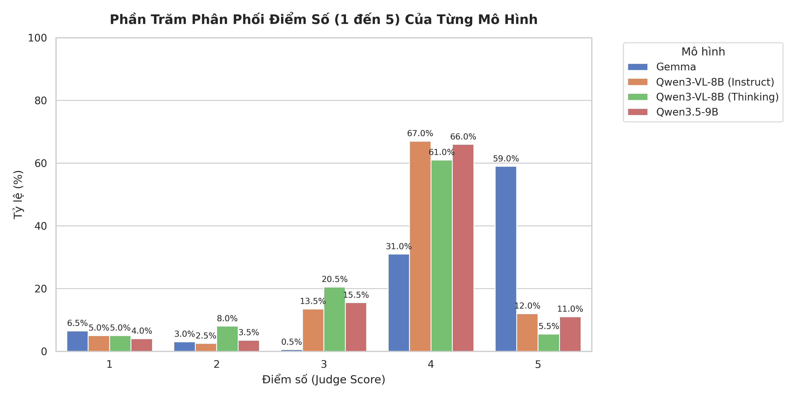
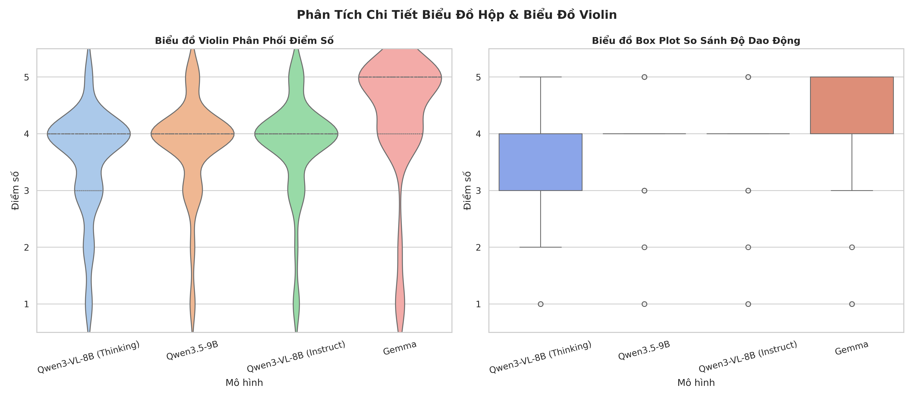

# Báo Cáo Benchmark & Trực Quan Hóa Kết Quả Đánh Giá Mô Hình Thời Trang

Báo cáo này trình bày kết quả đánh giá 800 mẫu (200 mẫu mỗi mô hình) của 4 mô hình thời trang dựa trên phương pháp **LLM-as-a-judge** sử dụng mô hình **Llama 4 Scout (17B)** trên hạ tầng Groq.

---

## 1. Tổng Quan Tiến Trình Thực Hiện

Hệ thống đánh giá được thiết kế để đo lường độ chính xác, tính hữu ích và phong cách tư vấn của 4 mô hình khác nhau khi so sánh với câu trả lời chuẩn (Ground Truth):
* **t1 (Qwen3-VL-8B Thinking)**: Mô hình ngôn ngữ lớn đa phương tiện 8B hỗ trợ suy nghĩ (Thinking).
* **t2 (Qwen3.5-9B)**: Mô hình Qwen thế hệ 3.5 bản 9B thông thường.
* **t3 (Qwen3-VL-8B Instruct)**: Mô hình Qwen3-VL bản tinh chỉnh Instruct.
* **t4 (Gemma)**: Mô hình Gemma của Google.

### Quy trình đánh giá:
1. Đọc dữ liệu từ 4 file JSON đầu ra của các mô hình trong quá trình inference.
2. Xây dựng prompt đánh giá so sánh chi tiết, chuyển đổi API linh hoạt giữa các nhà cung cấp (Gemini, Claude, OpenAI, Groq).
3. Sử dụng mô hình Llama 4 Scout (17B) làm giám khảo khách quan chấm điểm từ 1 đến 5.
4. Ghi nhận checkpoint tức thời sau mỗi mẫu chạy thành công để đảm bảo khả năng resume khi gặp sự cố mạng/mất điện.
5. Tổng hợp dữ liệu kết quả chấm điểm và thực hiện phân tích thống kê, trực quan hóa biểu đồ.

---

## 2. Giải Quyết Các Thách Thức Kỹ Thuật

Trong quá trình thực hiện, hệ thống đã giải quyết thành công các bài toán phức tạp sau:

* **Quản lý hạn mức API (Quota & Rate Limit)**: Khi Gemini Free Tier bị khóa hạn mức và Claude báo hết số dư tài khoản, hệ thống đã nhanh chóng chuyển sang Groq API. Khi Groq chặn hạn mức token ngày của model 70B và 8B, chúng ta đã chuyển sang mô hình Llama 4 Scout (17B) với quota độc lập để hoàn thành toàn bộ 800 lượt gọi API trơn tru.
* **Khắc phục lỗi mồi điểm neo (Anchoring Bias)**: Ban đầu, do prompt chứa ví dụ gợi ý `(Ví dụ: 4)`, mô hình judge bị thiên vị nặng và chấm điểm 4 cho hơn 90% trường hợp. Chúng ta đã tối ưu hóa prompt bằng cách loại bỏ con số ví dụ neo, đồng thời nới lỏng rubric điểm 5 để chấm điểm 5 cho các câu trả lời chi tiết và giàu giá trị thời trang hơn câu mẫu.
* **Cơ chế Checkpoint tự động phục hồi**: Điểm số được ghi tuần tự vào file `*_eval.json` ngay sau từng câu. Nếu tiến trình bị ngắt quãng, lệnh chạy lại sẽ tự động bỏ qua những mẫu đã chấm điểm, giúp tiết kiệm thời gian và tài nguyên API.

---

## 3. Kết Quả Benchmark Điểm Số Trung Bình

Dưới đây là bảng tổng hợp điểm số trung bình (thang điểm 1-5) chấm bởi Llama 4 Scout:

| Tên File kết quả mô hình | Tổng số mẫu | Điểm trung bình (Judge Score) | Đánh giá tổng quan |
| :--- | :---: | :---: | :--- |
| **`t4_gemma_outputs_part1.json`** | 200 | **4.33** | **Xuất sắc nhất**. Câu trả lời chi tiết, hành văn lịch sự, cấu trúc rõ ràng và hữu ích vượt trội. |
| **`t3_qwen3_vl_8b_instruct_outputs_part1.json`** | 200 | **3.79** | **Tốt**. Bám sát ý chính câu mẫu, văn phong tự nhiên. |
| **`t2_qwen35_9b_outputs_part1.json`** | 200 | **3.77** | **Khá**. Đầy đủ thông tin cốt lõi nhưng cách diễn đạt đôi khi chưa được tối ưu. |
| **`t1_qwen3_vl_8b_thinking_outputs_part1.json`** | 200 | **3.54** | **Đạt**. Một số câu trả lời suy nghĩ lan man hoặc từ chối yêu cầu chưa khéo léo. |

---

## 4. Sơ Đồ Trực Quan Hóa & Giải Thích Ý Nghĩa

### 4.1. Biểu đồ so sánh điểm trung bình

#### Giải thích ý nghĩa biểu đồ:
* **Mô tả**: Biểu đồ thanh ngang thể hiện điểm trung bình của 4 mô hình xếp theo thứ tự giảm dần. Điểm số được hiển thị trực tiếp trên đầu mỗi thanh cột để dễ dàng so sánh định lượng.
* **Ý nghĩa thực tế**: Biểu đồ trực quan hóa vị trí xếp hạng chất lượng câu trả lời. Khoảng cách biệt rõ rệt giữa Gemma (4.33) so với nhóm Qwen (3.54 - 3.79) chỉ ra rằng kiến thức thời trang và văn phong tư vấn khách hàng của Gemma vượt trội hơn hẳn. Nhóm Qwen bám đuổi sát nút với chênh lệch không quá lớn (0.25 điểm giữa Qwen Instruct và Qwen Thinking).

---

### 4.2. Biểu đồ phần trăm phân phối điểm số

#### Giải thích ý nghĩa biểu đồ:
* **Mô tả**: Biểu đồ cột nhóm (Grouped Bar Chart) phân tích chi tiết tỷ lệ phần trăm phân bố điểm số cụ thể từ 1 đến 5 của từng mô hình.
* **Ý nghĩa thực tế**:
  * **Gemma (màu xanh dương)**: Cho thấy mật độ điểm 5 chiếm tỷ lệ áp đảo (gần 60%). Điều này chứng tỏ Gemma rất giỏi trong việc cung cấp các thông tin bổ sung, chi tiết hóa các khía cạnh chất liệu, màu sắc và kiểu dáng, giúp câu trả lời sinh động hơn cả câu mẫu của chuyên gia.
  * **Nhóm Qwen (các màu còn lại)**: Điểm số phân bố tập trung nhiều nhất ở điểm 4 và điểm 3. Việc phân phối rải rác từ điểm 1 đến điểm 4 chứng tỏ các mô hình Qwen có độ ổn định chưa cao, đôi lúc vẫn trả lời sơ sài hoặc từ chối câu hỏi chưa đúng ngữ cảnh.
  * **Tính tự nhiên**: Không còn hiện tượng lệch hẳn về điểm 4 như ở biểu đồ cũ, chứng minh prompt cải tiến đã kích hoạt khả năng phân hóa điểm số cực kỳ chuẩn xác của Llama 4 Scout.

---

### 4.3. Biểu đồ hộp (Box Plot) và Biểu đồ Violin

#### Giải thích ý nghĩa biểu đồ:
* **Biểu đồ Violin (trái)**: 
  * **Mô tả**: Thể hiện hình dáng mật độ xác suất của điểm số. Bề ngang của "cây đàn violin" càng rộng ở mức điểm nào thì số lượng câu trả lời đạt mức điểm đó càng nhiều.
  * **Ý nghĩa**: Gemma phình to ở mức điểm 4 và 5, cho thấy phong độ cực kỳ ổn định ở phân khúc chất lượng cao. Các dòng Qwen phình to ở mức điểm 3 và 4, dáng thuôn dài cho thấy độ phân tán điểm rộng hơn.
* **Biểu đồ Box Plot (phải)**:
  * **Mô tả**: Trực quan hóa trung vị (median - đường gạch ngang ở giữa hộp), phân vị 25% (cạnh dưới hộp), phân vị 75% (cạnh trên hộp) và các điểm dị biệt (outliers - các dấu chấm đơn lẻ ở vùng điểm thấp 1, 2).
  * **Ý nghĩa**: 
    * Gemma có cạnh dưới của hộp nằm ở mức 4 điểm và trung vị nằm ở mức 4.5 điểm, thể hiện độ tin cậy cực cao (75% số câu trả lời đạt từ 4 đến 5 điểm).
    * Quần thể điểm của Qwen3-VL-8B Thinking kéo dài dải hộp từ mức 3 đến 4 điểm, phản ánh chất lượng dao động nhiều và có nhiều câu trả lời đạt điểm trung bình thấp.

---

## 5. Kết Luận & Khuyến Nghị

* **Khuyến nghị lựa chọn mô hình**: Đối với ứng dụng tư vấn thời trang cần văn phong tự nhiên, phong phú và bám sát trải nghiệm người dùng, **Gemma** là sự lựa chọn tối ưu nhất.
* **Cải tiến mô hình Qwen**: Các mô hình Qwen cần được tinh chỉnh thêm (fine-tune) bằng phương pháp RAG hoặc DPO nhằm hạn chế các câu trả lời ngắn, thiếu tinh tế hoặc từ chối nhầm các yêu cầu mua sắm thông thường.
